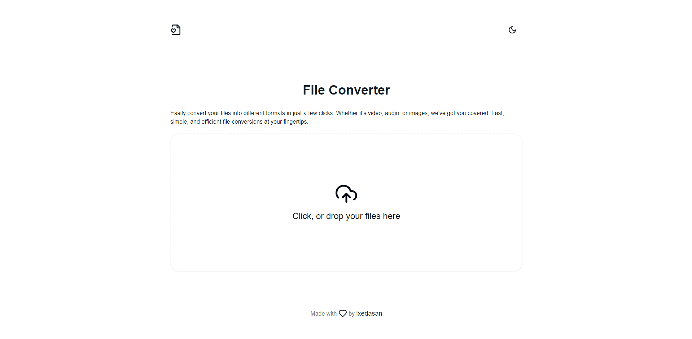

# File Converter

A simple and efficient file converter that allows you to upload and convert various file types (video, audio, image) into different formats. Built with Next.js, it features an intuitive drag-and-drop interface, customizable themes, and fast processing for a smooth user experience.

[**Demo Link**](https://file-converter-teal.vercel.app/)

[**PROJECT STRUCURE**](./structure.md)

## Preview



## Features

- 🖼️ **Drag-and-Drop**: Easily upload your files using the drag-and-drop feature.
- 🔄 **Multiple Formats**: Supports conversion between various video, audio, and image formats.
- 🎨 **Theme Toggle**: Switch between light and dark themes with the built-in theme switcher.
- ⚡ **Fast Conversion**: Quickly convert files using the power of `ffmpeg`.
- 📂 **Download & Save**: Download the converted files with a single click.

## Installation

To clone and run this application, you'll need [Git](https://git-scm.com/) and [PNPM](https://pnpm.io/) installed on your computer. From your command line:

```bash
# Clone this repository
$ git clone https://github.com/ixedasan/file-converter

# Navigate to the project directory
$ cd file-converter

# Install dependencies
$ pnpm install

# Start the development server
$ pnpm dev
```

## Contributing

Contributions are welcome! Please feel free to submit a Pull Request.
